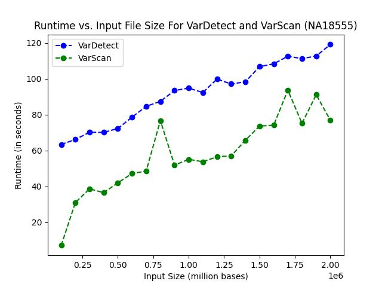

# Benchmarking `VarDetect` Against `VarScan`

We benchmarked `VarDetect` in 3 different ways against `VarScan`:

1. Comparing runtime between `VarDetect` and `VarScan` with the same optional flags using the datasets from lab (`NA12878_child, NA12891_father, NA12892_mother`) and datasets of our own choosing (`NA18555, HG02603, HG000145`).
2. Comparing accuracy of `VarDetect` using results of `VarScan` as the 'ground truth'. We did this by looking at the variants found by `VarDetect` and see if these variants are also found in the variants found by `VarScan`. Using the number of matching variants found by both tools, we computed the % accuracy of `VarDetect` as (# of matching variants found by both tools/# of variants found by `VarScan`)*100.
3. Comparing runtime between `VarDetect` and `VarScan` for different input sizes. Here, we used the `NA18555` dataset and generated 20 different `.mpileup` files with varying sizes in 100,000 bases increments from 100,000 to 2,000,000 bases.

The entire analysis of our benchmarking can be found in the `analysis` folder. Refer to the `README.md` file in the folder first to get an understanding.

## 1. Runtime Between `VarScan` And `VarDetect` With Different Datasets

From our analysis, `VarDetect` is slower than `VarScan` in every dataset that both tools were ran on. 

- For `NA12878_child`, `VarDetect` was ~2.28x slower.

- For `NA12891_father`, `VarDetect` was ~2.27x slower.

- For `NA12892_mother`, `VarDetect` was ~2.33x slower.

- For `NA18555`, `VarDetect` was ~1.95x slower.

- For `HG02603`, `VarDetect` was ~2.09x slower.

- For `HG00145`, `VarDetect` was ~3.18x slower.

On average across all 6 datasets, `VarDetect` is about 2.35x slower than `VarScan`. On average across all datasets from lab (`NA12878_child, NA12891_father, NA12892_mother`), `VarDetect` is about 2.29x slower than `VarScan`. On average across all datasets of our own choosing (`NA18555, HG02603, HG000145`), `VarDetect` is about 2.41x slower than `VarScan`. Runtime for both tools were measured using datasets containing roughly 200,000 positions in chromosome 6 (lab datasets) and chromosome 10 (datasets that we chose) of the human genome and the same optional flags used for variant calling.

In conclusion, `VarDetect` takes about ~2.3x more time to run than `VarScan` using the same dataset with equal size and same optional flags.
## 2. Accuracy Between `VarScan` And `VarDetect` With Different Datasets

From our analysis, `VarDetect` was only able to find a subset of the variants that `VarScan` found (the assumed 'true' variants).

- For `NA12878_child`, VarDetect found 13.41% of the 'true' variants.

- For `NA12891_father`, VarDetect found 18.60% of the 'true' variants.

- For `NA12892_mother`, VarDetect found 14.77% of the 'true' variants.

- For `NA18555`, VarDetect found 52.11% of the 'true' variants

- For `HG02603`, VarDetect found 41.61% of the 'true' variants

- For `HG00145`, VarDetect found 51.31% of the 'true' variants.

On average across all 6 datasets, `VarDetect` found about 31.97% of the 'true' variants. On average across all datasets from lab (`NA12878_child, NA12891_father, NA12892_mother`), `VarDetect` found about 15.59% of the 'true' variants. On average across all datasets of our own choosing (`NA18555, HG02603, HG000145`), `VarDetect` found about 48.34% of the 'true' variants. Accuracy for `VarDetect` was measured by running 200,000 positions in chromosome 6 (lab datasets) and chromosome 10 (datasets that we chose) of the human genome in each of the 6 datasets using both `VarDetect` and `VarScan`. Then, the output files of both tools were examined and analyzed for accuracy.

Here, we notice that the accuracy for `VarDetect` is low for the lab datasets but is higher for the datasets that we chose. Further investigation would be needed to discover why this is the case.

## 3. Runtime of `VarDetect` and `VarScan` For Varying Input Sizes

For this analysis, we used `NA18555` as the dataset and extracted incrementing sizes of data from `NA18555`. We created 20 `.mpileup` files, ranging from 100,000 bases to 2,000,000 bases, incrementing by 100,000 for each. Then, we ran both `VarScan` and `VarDetect` on each of the `.mpileup` file, recorded the runtime (user + sys), and plotted the runtimes for each input size for each tool. Positions in the `.mpileup` files were all taken from chromosome 10 of the human genome.

Here, we can see that `VarDetect`'s runtime is worse than `VarScan` (also shown in the first benchmarking method). We also see that `VarDetect` and `VarScan`'s runtime scale linearly.

## Datasets that We Chose

NA18555 - Female Han Chinese in Beijing, China: https://www.internationalgenome.org/data-portal/sample/NA18555  
HG02603 - Male Punjabi in Lahore, Pakistan: https://www.internationalgenome.org/data-portal/sample/HG02603  
HG00145 - Male British in Britain and Scotland:  https://www.internationalgenome.org/data-portal/sample/HG00145
